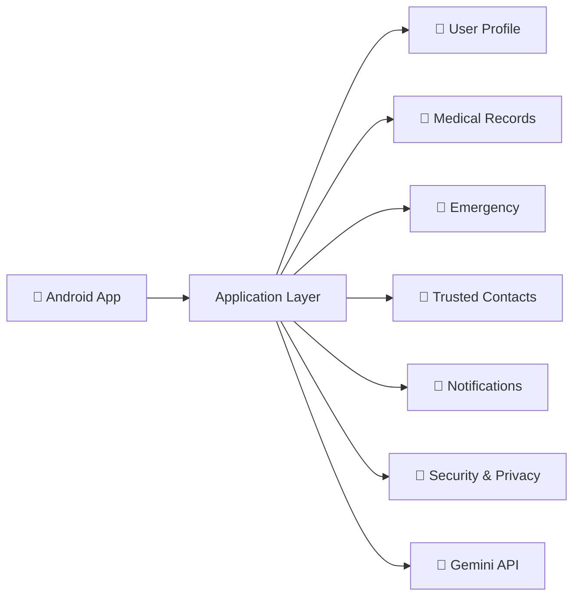
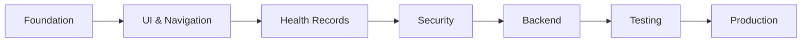
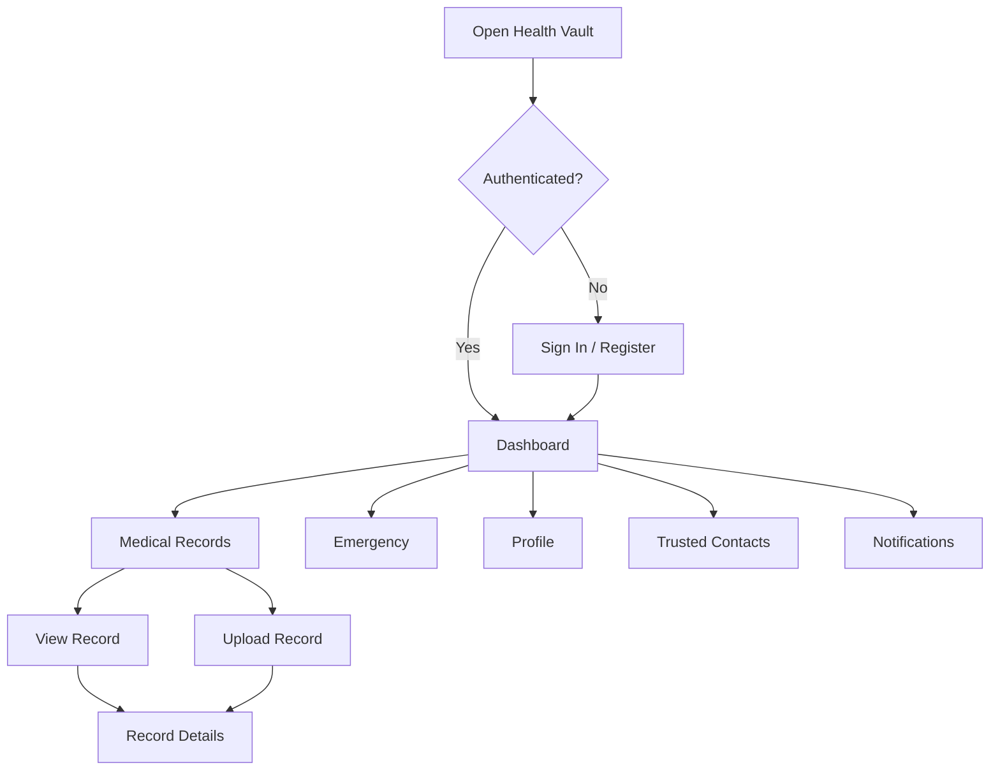

# 🏥 Health Vault

### Privacy-first digital medical record management for Android

Health Vault is an Android application focused on helping people keep their important health information and medical records organized in one place.

The idea is simple: instead of keeping medical reports, prescriptions, and other health information scattered across different folders, devices, or physical documents, Health Vault aims to provide a dedicated personal space for managing them.

> 🚧 **Status:** Active development
> Health Vault is currently a development project and is not yet intended for storing real patient data in a production environment.

---

## ✨ What is Health Vault?

Medical records tend to accumulate over time. Lab reports, prescriptions, scans, hospital documents, and other medical information can easily become difficult to find when they are actually needed.

Health Vault is being built around a **personal health vault** concept — a centralized Android application where users can organize their health information and access important details when needed.

The project places particular emphasis on:

* 🔐 Privacy
* 🛡️ Security
* 📄 Medical record organization
* 🚨 Emergency information
* 👤 Personal health information
* 📱 Simple mobile access

The repository is currently an Android project using **Gradle Kotlin DSL** and was initially created from the Google AI Studio Android repository template. The project is being developed further into the Health Vault application.

---

## 🎯 Project Goals

Health Vault is being developed around four main goals.

| Goal             | Description                                               |
| ---------------- | --------------------------------------------------------- |
| 🔐 Privacy       | Keep personal health information under the user's control |
| 🗂️ Organization | Bring important medical information into one place        |
| ⚡ Accessibility  | Make important information easier to find when needed     |
| 🛡️ Security     | Build the application with sensitive health data in mind  |

---

## 🧩 Main Areas

The application is being developed around several key areas.

### 📄 Medical Records

A central location for organizing personal medical documents.

Possible records include:

* Laboratory reports
* Prescriptions
* Diagnostic reports
* Hospital documents
* Medical summaries
* Other health-related files

### 👤 Personal Health Information

Important information about the user can be kept together rather than being scattered across different applications or documents.

### 🚨 Emergency Information

Health Vault includes an emergency-focused concept intended to make critical information easier to access when time matters.

### 👥 Trusted Contacts

Important contacts can be maintained for situations where someone else may need to be contacted.

### 🔔 Notifications

A notification area is planned to keep users informed about relevant application activity.

### 📋 Activity & Audit Information

The project also considers activity tracking as part of its privacy and accountability model.

---

# 🏗️ Architecture

The application is being developed as an Android client with privacy and health-record functionality at the center.



The exact backend and data-storage architecture will continue to evolve as development progresses.

---

# 🛠️ Technology

| Layer               | Technology                           |
| ------------------- | ------------------------------------ |
| Platform            | Android                              |
| Build system        | Gradle                               |
| Build configuration | Kotlin DSL                           |
| AI integration      | Gemini API capability                |
| Project foundation  | Google AI Studio repository template |
| Version control     | Git / GitHub                         |
| Configuration       | `.env.example`                       |

The repository currently contains an Android `app` module, Gradle configuration, project metadata, environment configuration examples, and AI Studio-related project assets.

---

# 📁 Project Structure

```text
Helath_Vault/
│
├── app/
│   └── Android application
│
├── assets/
│   └── Project assets
│
├── gradle/
│   └── Gradle configuration
│
├── .env.example
├── .gitignore
├── build.gradle.kts
├── gradle.properties
├── metadata.json
├── settings.gradle.kts
└── README.md
```

> The repository structure may change as the application moves from prototype development toward a more complete production architecture.

---

# 🔐 Privacy & Security

Health information is sensitive by nature, so security is one of the main considerations behind Health Vault.

The project follows a **privacy-first direction** and is intended to eventually support security practices appropriate for personal medical information.

Areas being considered include:

* Secure authentication
* Access control
* Secure document handling
* Protected API communication
* Local data protection
* Activity and audit logging
* Secure session management
* Appropriate handling of application secrets

### ⚠️ Important

Health Vault is still under development.

The current development version should **not be treated as a production healthcare system** and should not be used to store real patient information until the application's security, privacy, storage, authentication, and testing mechanisms have been properly implemented and reviewed.

---

# 🚀 Getting Started

## Prerequisites

You will need:

* [Android Studio](https://developer.android.com/studio)
* Android SDK
* A compatible JDK
* Git
* Android emulator or physical Android device

---

## Clone the repository

```bash
git clone https://github.com/Aayush0Murumkar/Helath_Vault.git

cd Helath_Vault
```

---

## Open the project

1. Open **Android Studio**
2. Select **Open**
3. Choose the `Helath_Vault` directory
4. Allow Gradle to synchronize
5. Wait for the project dependencies to finish loading
6. Select an emulator or connected Android device
7. Run the application

---

# ⚙️ Environment Variables

The repository includes an `.env.example` file that can be used as a reference for development configuration.

Do not commit sensitive credentials to GitHub.

```text
.env
```

should remain local if it contains:

* API keys
* Passwords
* Authentication tokens
* Database credentials
* Private keys
* Other secrets

Use `.env.example` to document the required variables without exposing their actual values.

---

# 📊 Development Roadmap

Health Vault is being developed in stages.



### Phase 1 — Foundation

* [x] Android project initialized
* [x] GitHub repository created
* [x] Gradle Kotlin DSL
* [x] Android application module
* [x] AI Studio project foundation

### Phase 2 — Application UI

* [ ] Finalize application design system
* [ ] Complete navigation
* [ ] Improve screen layouts
* [ ] Add loading and error states
* [ ] Improve accessibility
* [ ] Add responsive layouts

### Phase 3 — Health Records

* [ ] Medical record upload
* [ ] Record categorization
* [ ] Record search
* [ ] Record filtering
* [ ] Document preview
* [ ] Record details
* [ ] Secure deletion

### Phase 4 — Security

* [ ] Authentication
* [ ] Session management
* [ ] Biometric protection
* [ ] Secure local storage
* [ ] Access controls
* [ ] Audit logging
* [ ] Security testing

### Phase 5 — Backend

* [ ] Backend API
* [ ] User authentication
* [ ] Health-record APIs
* [ ] Secure file storage
* [ ] Database integration
* [ ] API authorization

### Phase 6 — Production

* [ ] Automated testing
* [ ] Performance optimization
* [ ] Security review
* [ ] Accessibility testing
* [ ] Release configuration
* [ ] Production documentation

---

# 📱 Planned User Flow



---

# 🧠 Design Philosophy

Health Vault is not intended to be just another file-storage application.

The broader idea is to make personal health information:

**Organized → Accessible → Private → Useful**

The application should make it easier for a person to answer a simple question:

> **"Where is my important health information when I need it?"**

The goal of Health Vault is to make the answer:

> **"In my Health Vault."**

---

# 🔭 Future Possibilities

As the project develops, additional capabilities may be explored.

Some possibilities include:

* 🏥 Hospital and doctor organization
* 💊 Medication information
* 💉 Vaccination records
* 📈 Health history timelines
* 👨‍👩‍👧 Family health profiles
* 🔗 Secure record sharing
* ⏱️ Temporary access permissions
* 📱 QR-based emergency access
* 📦 Health-data export
* ☁️ Backup and synchronization
* 🤖 AI-assisted document organization

These are **future possibilities**, not claims that all of these features are currently implemented.

---

# 🧪 Project Status

Health Vault is currently an **active development project**.

### Current focus

```text
Android Foundation       ██████████░░░░░░░░░░
Application UI           ████████░░░░░░░░░░░░
Health Records           █████░░░░░░░░░░░░░░░
Security                 ████░░░░░░░░░░░░░░░░
Backend                  ███░░░░░░░░░░░░░░░░░
Testing                  ██░░░░░░░░░░░░░░░░░░
```

> **Note:** The progress bars above are a visual representation of the development roadmap, not measured project-completion percentages.

---

# 🤝 Contributing

Health Vault is currently being developed as an active project.

If you want to contribute:

```bash
git checkout -b feature/your-feature
```

Make your changes, test them, and then:

```bash
git add .
git commit -m "Add your feature"
git push origin feature/your-feature
```

When submitting a Pull Request, include:

* What you changed
* Why you changed it
* How you tested it
* Any security or privacy considerations

For a healthcare-related project, avoid submitting real medical information or personal health data.

---

# 🔒 Responsible Development

Never commit real patient information to the repository.

Do not upload:

* Medical reports
* Patient records
* Government identification documents
* Passwords
* API keys
* Authentication tokens
* Database credentials
* Private certificates
* Production secrets

Use dummy or synthetic data during development.

---

# ⚠️ Medical Disclaimer

Health Vault is a software project for organizing and managing personal health information.

It is **not a medical diagnostic tool** and does not replace professional medical advice, diagnosis, or treatment.

Medical decisions should always be made with an appropriately qualified healthcare professional.

---

# 📄 License

A license has not yet been specified for this repository.

Until a license is added, the code should not be assumed to be freely reusable, modified, or redistributed.

---

# 👨‍💻 Project

**Health Vault**

Built as an Android privacy-focused health-record project.

**Repository:**
https://github.com/Aayush0Murumkar/Helath_Vault

**Status:** 🚧 Active Development

---

<div align="center">

### 🏥 Health Vault

**Your health information. Organized. Accessible. Private.**

⭐ If you find the project interesting, consider giving the repository a star.

</div>
